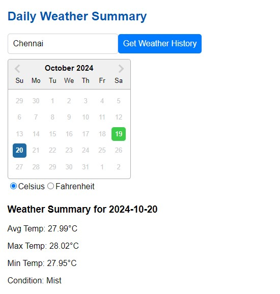
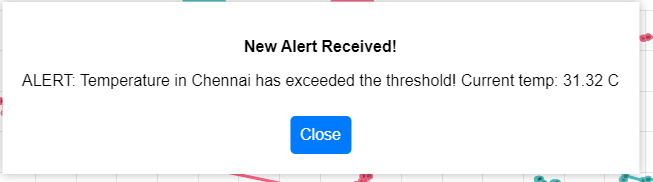
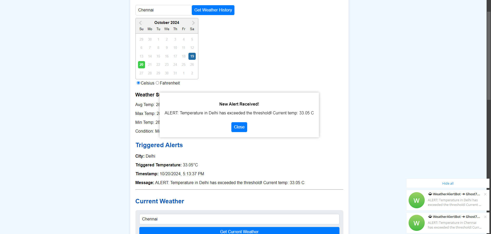
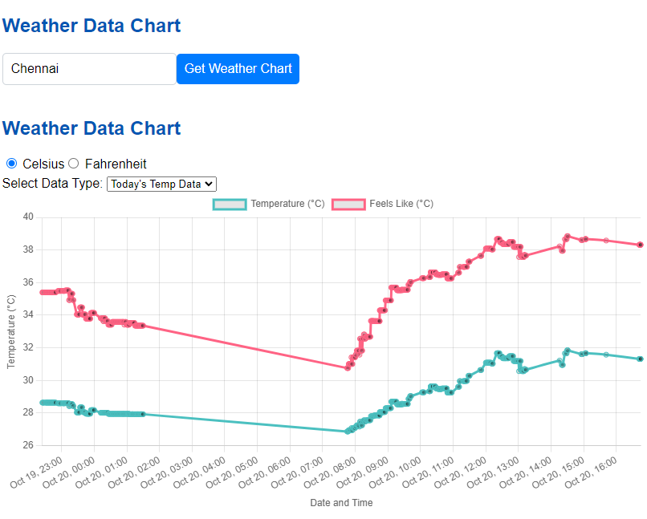
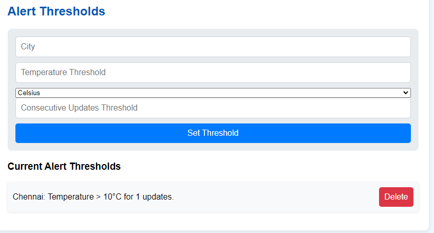

# Weather-Monitor

Weather-Monitor is a real-time data processing system designed to monitor weather conditions and provide summarized insights using rollups and aggregates. The system utilizes data from the OpenWeatherMap API (https://openweathermap.org/) to deliver up-to-date weather information.

## Project Structure

The project is divided into two main components:

1. **Backend**: A Spring Boot application
2. **Frontend**: A React application


## Prerequisites

- Java 17+
- Maven
- Node.js and npm
- MySQL (or Docker for running MySQL)

## Setup and Running

### Backend Setup

1. Navigate to the backend directory:
   ```
   cd Backend/weather-monitor
   ```

2. Create a `.env` file in the root directory with the following content:
   ```
   WEATHER_API=YourOpenWeatherApiKey
   TELEGRAM_BOT_TOKEN=YourTelegramBotToken
   CHAT_ID=YourChatId
   ```
   Note: Telegram bot token and chat ID are optional. Only add if you want alerts in Telegram.

    <details>
    <summary>Click here to check how to get the API Keys</summary>
   
    - To obtain an OpenWeatherMap API key, visit https://openweathermap.org/ and sign up for an account.
    - For setting up a Telegram bot and obtaining the bot token, use https://t.me/BotFather
    - To get your Telegram chat ID, use https://t.me/chatIDrobot
   </details>

   Note: If you are using Telegram Bot then send the bot you made a Message else you won't receive Notification
3. Database Setup:
    - Option 1: Use Docker
      Run the following command to start the MySQL database:
      ```
      docker-compose up
      ```
    - Option 2: Manual Setup
      If you prefer to set up the database manually, update the `src/main/resources/application.properties` file with your database configuration:
      ```
      spring.datasource.url=jdbc:mysql://localhost:3307/weather_db
      spring.datasource.username=your_username
      spring.datasource.password=your_password
      ```

4. Start the Spring Boot application:
   ```
   mvn spring-boot:run
   ```

### Frontend Setup

1. Navigate to the frontend directory:
   ```
   cd Frontend/weather-monitoring-frontend
   ```

2. Install dependencies:
   ```
   npm install
   ```

3. Start the React application:
   ```
   npm start
   ```
   
# Project Demo images
<details>
<summary>Click here to check project Demo</summary>



</details>

# Design Choices

<details>
<summary>Database: Why MySQL?</summary>

Think about it - we're constantly saving temperatures, conditions, and timestamps for different cities. MySQL handles this kind of structured data really well.

I could have used MongoDB or PostgreSQL, but MySQL just made more sense here. It's super easy to set up, works great with Spring Boot (which I was already using), and most developers are familiar with it. Plus, when I need to pull out weather history or calculate daily averages, MySQL's query capabilities make this really straightforward.
</details>

<details>
<summary>⏰ Scheduling: Why Quartz?</summary>

For fetching weather data every 5 minutes, I needed something reliable. Sure, I could have used a simple cron job or Spring's built-in scheduler, but Quartz gives us more flexibility. Here's why:
- It's really easy to change how often we fetch data without redeploying the app
- If something crashes, Quartz remembers where it left off and picks up the jobs
- We can add more cities later without messing with the existing schedule
- It handles time zones well (important when dealing with different cities!)

Right now, it's set up to fetch data every 5 minutes for Delhi, Mumbai, Chennai, Bangalore, Kolkata, and Hyderabad. If we need to change this timing or add more cities, it's just a configuration change.
</details>

<details>
<summary>⚛️ Frontend: Why React?</summary>

1. I needed to show live weather updates and alerts - React's component-based structure makes this super smooth
2. Found some great libraries that saved tons of time:
    - Used Recharts for those nice weather graphs
    - React Calendar made it easy to let users pick dates and view historical data
3. The WebSocket integration for live alerts was straightforward with React

</details>

<details>
<summary>🔄 Real-time Updates: WebSocket Communication</summary>

For showing alerts in real-time (like when temperature crosses a threshold), polling the server every few seconds would have been inefficient. WebSocket lets the server push updates to the frontend immediately. This means users see alerts right away, and we're not hammering the server with constant requests.
</details>

<details>
<summary>📊 Daily Rollups</summary>

At the end of each day, the system automatically calculates:
- Average temperatures
- Highest and lowest temperatures
- Most common weather condition

This summarized data helps users track weather patterns over time without having to crunch the numbers themselves.
</details>

<details>
<summary>🌡️ Weather Service: Data Processing Logic</summary>

The Weather Service handles two crucial aspects of our application:

1. **Real-time Data Collection**
    - Fetches current weather data from OpenWeatherMap API
    - Converts temperatures between different units (Kelvin → Celsius → Fahrenheit)
    - Stores raw weather data with timestamps

2. **Daily Weather Analysis**
    - Calculates daily averages and extremes
    - Determines dominant weather conditions through frequency analysis
    - The dominant condition is calculated by:
        * Grouping all weather readings for a specific city and date
        * Counting occurrences of each condition (e.g., Clear, Cloudy, Rain)
        * Selecting the condition that appeared most frequently
        * In case of ties, the first condition is selected
</details>

<details>
<summary>⚠️ Alert Service: Threshold Monitoring</summary>

The Alert Service implements a sophisticated monitoring system:

1. **Temperature Monitoring**
    - Tracks temperature changes for each city
    - Supports both Celsius and Fahrenheit thresholds
    - Automatically converts between temperature units for comparison

2. **Consecutive Breach Detection**
    - Maintains a counter for each city
    - Increments when temperature exceeds threshold
    - Resets when temperature falls below threshold
    - Triggers alert only after specified consecutive breaches

3. **Multi-Channel Notifications**
    - Real-time WebSocket alerts to frontend
    - Telegram notifications for mobile updates
    - Persistent storage of triggered alerts for historical tracking

4. **Alert Recovery**
    - Automatic reset after alert triggering
    - Prevents alert flooding
    - Maintains separate breach counters for each city
</details>


---
